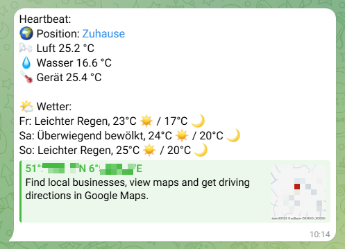

# ESP32 & SIM7000G GPS Tracker
track your vehicle's position (boat, camper, car) with this ESP32 Lilygo SIM7000G board - LTE-enabled, battery powered, with additional temperature sensors, daily telegram heartbeat and weather forecast. But let's see in detail.

*Remark 1*: This code isn't pretty. I had to cut several corners to make it happen. E.g. the Telegram API would be used the most elegant way by a HTTPS POST JSON call. I didn't manage to create a working SSL session with the hardware (even not with help of Copilot and ChatGPT) although it should be possible. That's the reason for the webhook solution. Feel free to improve!

*Remark 2*: This does not work well as a theft protection because it updates only once in 24h (or whatever you choose to configure instead), not event-triggered. To react to events, the ESP must be awake all the time, consuming battery all the time etc. That's not what I wanted to solve. Be aware of that.

The project is based on the Lilygo ESP32 SIM7000G board available for approx. 50 EUR - and probably compatible with this board only. I didn't plan for a universal solution, I wanted to get this specific board running. It comes with ESP32, a battery holder for a 18650 including a solar panel charging regulator, LTE enabled cellular modem and a GPS antenna. Pretty much everything you need.

Most credits go to: https://randomnerdtutorials.com/lilygo-t-sim7000g-esp32-lte-gprs-gps/ , my starting point for this project. Thanks a lot!

--------------------------

What does it do? Once a day (default ~10h in the morning):
- the ESP awakes and establishes a cellular data connection,
- it gets its current location and date/time via GPS,
- it measures the temperature of three attached 1wire temperature sensors (DS18B20),
- it sends the location and the temperatures to a HTTP webhook,
- it goes back to sleep for approx. 24h.

The webhook:
- compares the location to a list of given, known locations and determines the nearest known location,
- gets the weather forecast for the next days from openweathermap.org for the tracker's location,
- sends a summary as a Telegram message to one recipient

The Telegram message contains:
- the current location (either mapped to a known one, or including the distance to the nearest known location), including a Google maps link,
- the temperatures of the three sensors,
- the weather forecast for upcoming Fridays, Saturdays and Sundays at the tracker's location

All you need beyond the Lilygo board are three DS18B20 and a 4.7kOhm pullup resistor.

*Remark 3*: I'm not an overly talented software engineer. The project works, and I'm proud of it, but probably there are more elegant and/or more efficient ways of solving the problem. Feel free to improve.

-----------------------------------------
in detail
-----------------------------------------

HOW TO GET IT UP AND RUNNING

__hardware you will need__

- 1x Lilygo ESP32 SIM7000G board (others may work, but you are on your own there!)
- a data capable SIM card (microSIM) of a carrier operating in your country/countries
- optional: 1x 18650 battery (but makes a lot of sense)
- optional: 3x DS18B20 temperature sensor (outdoor recommended) + 1x 4.7kOhm resistor

__how to build__

Insert the battery into the battery holder (obviously). For the 1wire temperature sensors, connect all + wires to 3V3, all - wires to GND, all data wires to GPIO32. Additionally put the 4.7kOhm pullup resistor between 3V3 and GPIO32, as near as possible to the board.

That's it for the hardware!

__getting the webhook ready__

We must start with the webhook.php. You have to host it somewhere accessible from the internet in an environment that is capable of running PHP. I have an own webspace, so that was easy, but you may not. Choose a location for the webhook with the shortest URL you can manage, because the length of the URL the ESP32 can call using AT commands is limited.

"http://hp.com/w.php?......" would be perfect, but probably you are not HP. "http://my-really-long-domainname.com/projects/esp/gpstracker/this_funny_webhook_from_athol-de.php?..." is a bad idea. You get what I mean?

__inside the webhook: Telegram__

Before uploading the webhook you have to change it drastically to your needs.

*BOTtoken*: the webhook is in principle capable of serving different bots simultaneously. For the beginning a single bot token is sufficient. You will need a Telegram bot API key and therefore use a bot you already have or get a new one.

To get a new one, open Telegram (web or mobile device) and start talking to "BotFather". He will guide you through the process of creating a bot (and changing the name, adding a photo etc.). You will get the API key from him.

*recipient*: Then talk to "userinfobot" by typing "/start". This bot will tell you your own chatID. Finally, start talking to your own, newly created bot by typing "/start". It won't answer, but it is necessary that the conversation is initiated by you - it can't just start talking to you.

Now add your newly acquired BOTtoken and the chatID in rows for $BOTtoken and $recipient. I recommend to also fill in the rows starting with "default" - they will be used in case no bot reference and/or recipient reference are provided by the webhook caller. That makes the webhook more reliable, but anybody getting to know the URL can spam you (and only you!) with Telegram messages. So take your pick.

__inside the webhook: API keys__

This is only some basic protection against misusage of the webhook. You have to provide some (short!) API keys for all BOT ids you provided, including "default" (recommended). The webhook will work only in case the given BOT id and the given API key ("k" parameter) match. Create an API key with some password generator and make sure that the bot ID your ESP provides ("b=...") and the API key ("k=...") matches, otherwise the webhook will deny service.

__inside the webhook: reference points__

Now you can provide geographical reference points, e.g. your home, your marina, your favorite camping site, your winter storage area, whatever. In case your tracker is within 250m reach of one of these reference points, the Telegram message will express exactly that: "it's at home". If not, the distance to the nearest reference point is stated ("it's 510m from marina"). You can skip this for starters, the tracker will work anyway.

So even if your tracker is out in the field in your boat or your camper, you can still adjust reference points by changing the webhook and updating it via FTP.

__inside the webhook: openweathermap.org API__

Finally you have to get an openweathermap.org API key. You have to subscribe to the One Call 3.0 API and provide a payment method, but you get 2000 calls per day free before you are charged (with 0.0014 EUR per call beyond that; status as of 29.08.2025). So for our purposes here that's like free, but keep that in mind when deciding with whom (and how many) to share your webhook.

https://openweathermap.org/api/one-call-3

Enter your API key in "$owmApiKey = "YOUR_OPENWEATHERMAP.ORG_API_KEY_GOES_HERE";"

(Directly below that you see the openweathermap API call, including the parameters "units=" and "lang=". You can adjust it to your local units and language to get the weather information translated.)

Now upload it to your webspace and test it. You can anytime call it via browser:

http://yourdom.com/wh.php?b=mb&k=CREATE_YOUR_OWN_API_KEY1&r=ab&lat=50.1234&lon=6.7890&t1=20.1&t2=21.2&t3=22.3

- if you get "{"status":"ok"}", everything is fine, and a Telegram message has been sent. If you didn't get it, check BOTtoken API key, recipient etc. Did you start the conversation with your bot by "/start"? Otherwise the bot cannot reach out to you.
- if you get something like "{"status":"error","error":"Invalid API key for selected bot."}", check your configuration again.

__getting the ESP32 ready__

There is not that much to be done here. First, you need a SIM card. Any data capable SIM card will work, however there are specialized IoT SIM cards. For Europe, try the German whereverSIM or similar. Or perhaps you can get an additional multi card for your smartphone/tablet tariff plan. Or you simply acquire a new, cheap tariff plan. The tracker uses up approx. 200 byte (!) per call (just the URL and the response JSON) with perhaps some overhead, so a 1 MB/month tariff plan would be good for >100 messages a day (!).

Either deactivate the PIN protection of the SIM beforehand using a smartphone/tablet, or add the SIM's PIN to the code in "GSM_PIN".

Now, determine the APN [Access Point Name]. That's basically the "URL" of the gateway between the cellular network and the internet. Your carrier's website or selfcare area will give you this information. In most cases you don't have to provide username and password, but it might happen. This code uses the APN explicitly even if some carriers use APN override and will ignore wrong settings. If you suffer problems when roaming in foreign countries (where APN override does not work), but it works fine at home, probably your APN setting is wrong and your carrier is applying APN override.

Put your APN URL and credentials (if any) in apn[], gprsUser[] and gprsPass[].

Flash the firmware with your favorite IDE to the ESP32, and have a look at the serial monitor. You should see some information about the modem, your cellular carrier, the signal quality. Acquiring the GPS signal might take some time when firing up the first time - that is GPS-specific and can't be helped.

The tracker is not overly robust to bad GPS signal because it's intended to track vehicles that are typically outdoor. If you want to track e.g. a motorbike that might end up in an underground garage, you might want to change the GPS logic. But probably you won't have any cellular signal there anyway.

Looking forward to your feedback.
